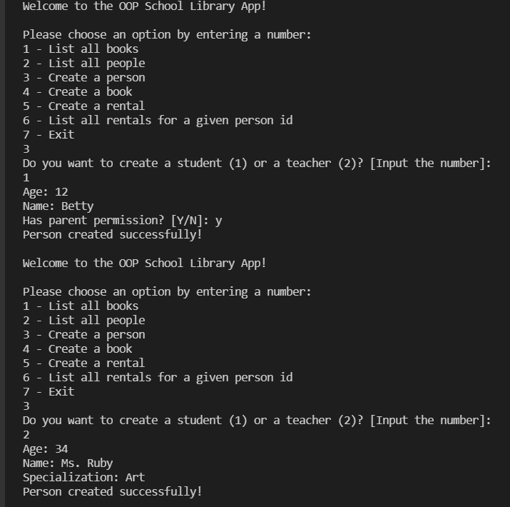
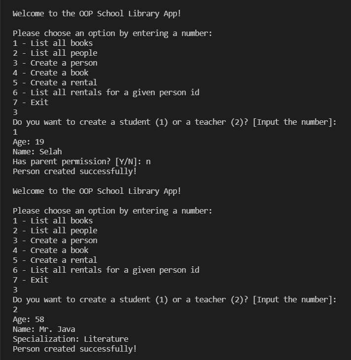
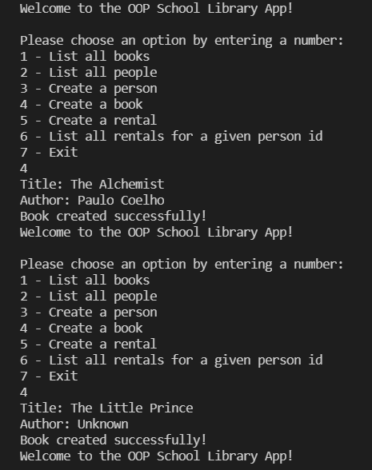
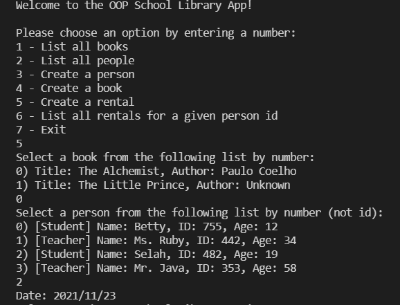
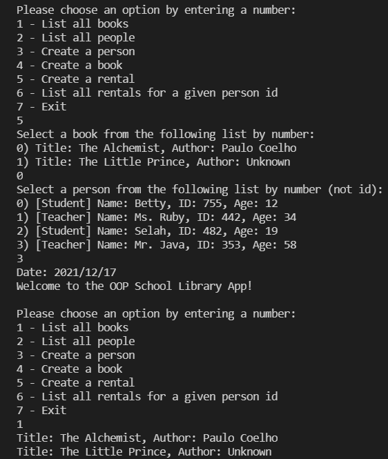
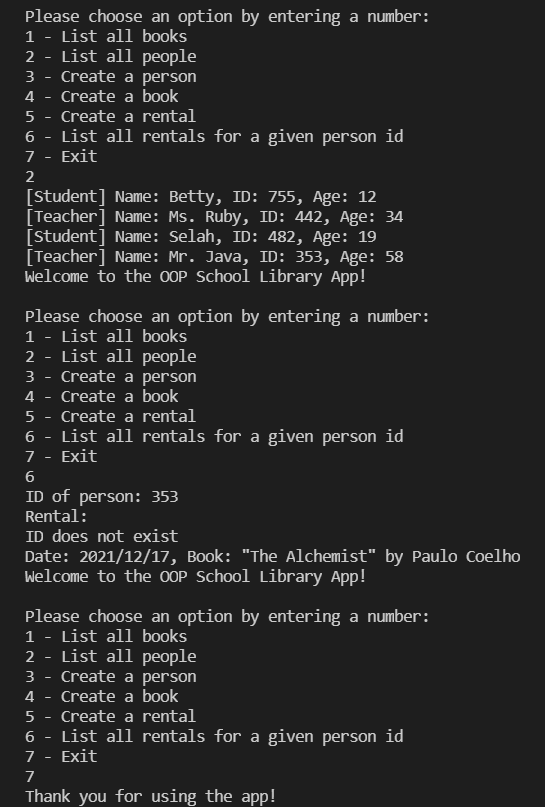

# OOP-School-Libraby

This app is a tool one can use in a library to record what books are in the library and who borrows them. This app will allow a you to:
- Add new students or teachers.
- Add new books.
- Save records of who borrowed a given book and when.

## Screenshots

> |Screenshot 1|Screenshots 2|
> |--------------|----------------|
> |||!
> |Screenshot 3|Screenshots 4|
> |--------------|----------------|
> |||!
> |Screenshot 5|Screenshots 6|
> |--------------|----------------|
> |||!

## Built With
- Ruby
  
## Setup
- Get the link of the repository: [https://github.com/chaw-bot/OOP-School-Library](https://github.com/chaw-bot/OOP-School-Library)
- Clone it as git@github.com:chaw-bot/OOP-School-Library.git on a Terminal
- Usage
- Run bundle install on a Terminal to get Gemfile dependencies.
- Run irb on a Terminal
  
## Author

👤 **Chawanzi Ng'uni**

- GitHub: [@chaw-bot](https://github.com/chaw-bot)
- Twitter: [@chaw36422087](https://twitter.com/chaw36422087)
- LinkedIn: [Chawanzi Ng'uni](https://www.linkedin.com/in/chawanzi-ng-uni-449328212/)

## 🤝 Contributing

Contributions, issues, and feature requests are welcome!

Feel free to check the [issues page](https://github.com/chaw-bot/OOP-School-Library/issues).

## Show your support

Give a ⭐️ if you like this project!

## Acknowledgments
- Microverse
- Ruby documentation
- Stack Overflow